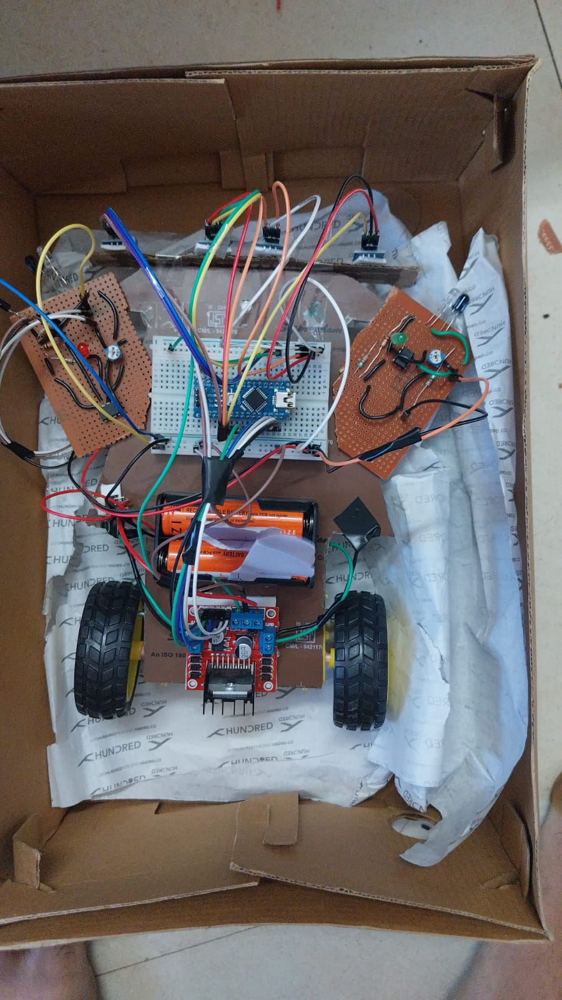

# Line-following-Robot
Arduino-based Line Following Robot using IR sensors and L298N Motor Driver.

## Overview

This project implements an autonomous Line Following Robot using Arduino and IR sensors.

## Components Used

- Arduino Nano
- IR Sensors
- L298N Motor Driver
- DC Motors
- Battery Pack

## Project Media

### Robot Photo

### Robot Video

## Demonstration Video

[Watch the Robot Demo](robot_demo.mp4)
The uploaded video demonstrates the robot following the designated path.

## Author

Samannay Mondal
B.Tech EIE
NIT Rourkela
